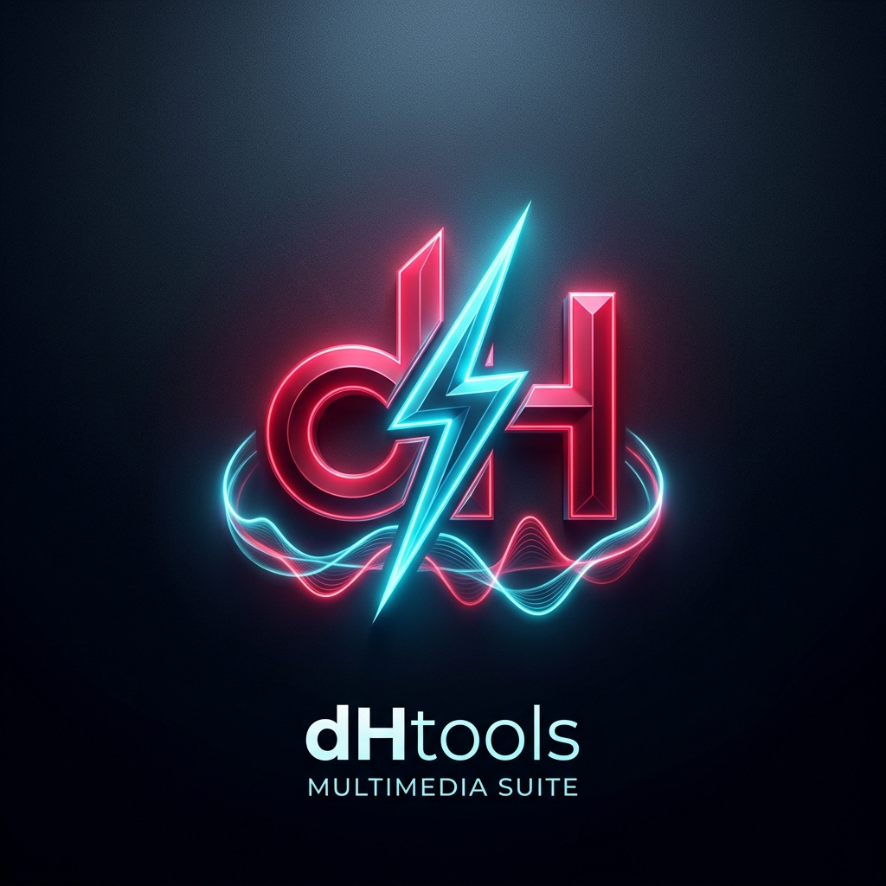

<p align="center">
  
</p>

<h1 align="center">⚡ dHtools - Suite Multimedia & Extractor Universal</h1>

<p align="center">
  <a href="https://github.com/hernancussit/dHtools"></a>
  <a href="https://python.org"></a>
  <a href="https://docker.com"></a>
  <a href="https://cafecito.app/henu_45"></a>
  <a href="LICENSE"></a>
</p>

**dHtools** es una plataforma web autohospedable y de alto rendimiento diseñada para la descarga, conversión, recorte y sincronización en la nube de contenido multimedia desde múltiples plataformas (**YouTube, Spotify, Deezer, TikTok, Instagram, Twitter/X, Twitch, Facebook y más**).

Está construida con una **arquitectura modular de Flask Blueprints**, diseñada para ejecutarse en tu propio servidor VPS o máquina local con **Docker Compose**, ofreciendo una interfaz moderna y reactiva con gestión multiusuario, autenticación de dos factores (2FA / TOTP), cuotas de almacenamiento en disco, servidor SMTP con recuperación de contraseñas, auditoría de sesiones en vivo, selector de canal de actualizaciones (`main` vs `dev`) y rollback automático en 1 clic.

---

## 🚀 Características Principales

### 🎯 Extracción Multiplataforma Inteligente
- **Motor en Cascada Automático (4 Niveles):** Combina inteligentemente **Cobalt v11 Oficial**, **Deezer/Spotify**, **yt-dlp nativo** y un **Respaldo Residencial de Último Recurso (Tier 4 / Residential Failsafe)** con fallback transparente.
- **Respaldo Residencial de Contingencia (Failsafe):** Activación autónoma de proxy SOCKS5 residencial solo si YouTube bloquea la IP del datacenter o degrada streams forzados SABR a 360p, preservando el ancho de banda hogareño para el resto de las tareas.
- **Calidades de Video Ultra HD:** Descarga en 4K (2160p), 2K (1440p), Full HD (1080p), 720p y 480p con selección de contenedor (`MP4` / `MKV`) y subtítulos incrustados.
- **Suite de Audio Hi-Fi:** Extracción directa con carátulas en alta resolución y metadatos ID3 automáticos en calidades `128 kbps`, `192 kbps`, `256 kbps` y `320 kbps (CBR MP3)`.
- **Playlists & Álbumes:** Detección automática y desglose de listas de reproducción con seguimiento ítem por ítem en tiempo real, priorización interactiva (⬆️/⬇️) y descarga agrupada en carpetas virtuales o archivo `.zip`.
- **Recorte Preciso por Tiempo (Trimming):** Descarga estricta por rangos temporales (`download_ranges` de yt-dlp) indicando tiempos de inicio y fin (`HH:MM:SS`), transfiriendo únicamente los minutos deseados sin descargar archivos completos a disco.
- **Descargas Unificadas en Lote:** Conmutador directo `[ 🔗 Enlace Único | 📋 Descarga en Lote ]` integrado en Modo Fácil y Modo Avanzado.
- **Cola de Descargas Asíncrona:** Procesamiento secuencial en segundo plano sin saturar la CPU o la memoria RAM del servidor.

### 🛡️ Blindaje de Seguridad Integral
- **Autenticación en Dos Factores (2FA / TOTP Opcional):** Estándar RFC 6238 compatible con Google Authenticator, Microsoft Authenticator, Authy, Bitwarden, etc., con QR dinámico y 8 códigos de recuperación de respaldo.
- **Control de Cuotas de Disco:** Asignación de cuotas máximas de almacenamiento por usuario con barra de progreso en vivo y bloqueo preventivo.
- **Auditoría de Sesiones Activas:** Monitor en tiempo real de sesiones conectadas (IP, dispositivo, navegador, última actividad) con revocación remota instantánea.
- **Servidor SMTP & Recuperación de Contraseñas:** Envío de correos seguros con tokens de un solo uso con 1 hora de validez para restablecer contraseñas.
- **Protección contra Fuerza Bruta:** Bloqueo temporal automático por IP tras 5 intentos fallidos con retraso progresivo (*tarpit*).
- **Prevención de RCE e Inyecciones de Shell:** Sanitización estricta de URLs (`validate_media_url`) y ejecución sin `shell=True`.
- **Protección contra Path Traversal:** Verificación canónica de rutas (`safe_download_path`) en todos los endpoints de archivo.
- **Evasión de Bloqueos de YouTube:** Deno integrado para resolución de desafíos JS y microservicio `potprovider` para generación continua de Proof-of-Origin Tokens.

### ⚙️ Panel de Administración & Gestión
- **Sistema de Actualizaciones en 1 Clic:** Comprobador de versiones contra GitHub y actualizador en caliente desde el panel web.
- **Selector de Canales:** Alterná entre la rama estable (`main`) y la rama de desarrollo (`dev`) directamente desde la interfaz.
- **Rollback Seguro:** Restauración inmediata a la versión anterior con un solo clic si algo falla.
- **Gestión Multiusuario:** Creación de usuarios con roles `Admin` y `Downloader`, cambio de contraseñas, asignación de cuotas, suspensión de cuentas y purga selectiva de descargas.
- **🤖 Asistente Interactivo de Telegram (Telegram Bot Hub):** Solicitá descargas compartiendo enlaces directamente a tu propio bot de Telegram con selección de calidades táctil (*Inline Keyboards*), seguimiento dinámico de progreso en el chat, consulta de historial (`/descargas`), cola (`/cola`) y cuota (`/cuota`), y entrega de archivos multimedia directos (<= 50 MB) o enlaces web seguros.
- **✈️ Envío a Telegram Bajo Demanda:** Opción en 1 clic desde la sección "Mis Descargas" para transferir cualquier archivo descargado directamente a tu Telegram.
- **☁️ Hub de Conectores Cloud con Presets Privados:** Perfiles de almacenamiento personalizados por usuario (Nextcloud/ownCloud vía **WebDAV**, servidores **FTP** y webhooks) con aislamiento total de credenciales y herramienta de validación de conexión en 1 clic.
- **Monitoreo en Tiempo Real:** Métricas en vivo del uso de CPU, RAM del proyecto vs VPS total y espacio en disco con purga automática configurable.

---

## 📦 Puesta en Marcha Rápida (Docker Compose)

### 1. Clonar el repositorio
```bash
git clone https://github.com/hernancussit/dHtools.git
cd dHtools
```

### 2. Configurar variables de entorno
```bash
cp .env.example .env
nano .env
```
*Definí tus credenciales de acceso (`APP_USERNAME` y `APP_PASSWORD`) y tu clave secreta de sesión.*

### 3. Iniciar los contenedores
```bash
docker compose up -d --build
```

La aplicación estará lista en `http://localhost:5000` (o `http://TU_IP_VPS:5000`).

---

## 🌐 Publicación con Dominio & SSL (Proxy Inverso)

Para publicar **dHtools** bajo tu propio dominio con HTTPS, dispones de configuraciones listas en la carpeta [`proxy-configs/`](proxy-configs/):

### 1. 🐧 Nginx Universal (Cualquier Servidor Linux / CloudPanel / aaPanel)
Utiliza la plantilla [`proxy-configs/nginx-universal.conf`](proxy-configs/nginx-universal.conf) en tu bloque de servidor:
```bash
sudo cp proxy-configs/nginx-universal.conf /etc/nginx/sites-available/dhtools.conf
# Edita tu dominio y certificados en el archivo y luego recarga:
sudo systemctl reload nginx
```

### 2. 🛡️ HestiaCP
Copia las plantillas oficiales de HestiaCP y aplícalas a tu dominio:
```bash
cp proxy-configs/hestiacp/dhtools-proxy.tpl  /usr/local/hestia/data/templates/web/nginx/
cp proxy-configs/hestiacp/dhtools-proxy.stpl /usr/local/hestia/data/templates/web/nginx/
systemctl reload nginx
```
*Luego selecciona la plantilla `dhtools-proxy` desde la configuración web del dominio en el panel de HestiaCP.*

### 3. 💼 cPanel / WHM (Apache mod_proxy)
Copia las reglas de [`proxy-configs/cpanel-apache.conf`](proxy-configs/cpanel-apache.conf) en el archivo `.htaccess` de la raíz web de tu dominio.

### 4. 🚀 Caddy Server
Añade a tu `Caddyfile` (configuración de [`proxy-configs/caddy-Caddyfile`](proxy-configs/caddy-Caddyfile)):
```caddy
tu-dominio.com {
    reverse_proxy 127.0.0.1:5000
}
```

*Consulta la guía detallada en [`proxy-configs/README.md`](proxy-configs/README.md).*

---

## 🍪 Configuración de Cookies de YouTube (Opcional / Avanzado)

**dHtools** cuenta con evasión antibot automática (`pot-provider` + Deno + Cobalt) y funciona **sin cookies** para el 95% de las descargas públicas. Sin embargo, si deseas descargar **videos con restricción de edad (+18)**, **contenido para miembros del canal** o **listas privadas**, puedes suministrar un archivo `cookies.txt`.

### ⚠️ Reglas Críticas de Seguridad y Operación:
> [!WARNING]
> 1. **Usá SIEMPRE una cuenta secundaria (desechable):** NUNCA exportes cookies de tu cuenta de Google/YouTube principal. La actividad constante de descargas desde una IP de servidor puede gatillar bloqueos temporales o suspensiones de cuenta por parte de Google.
> 2. **NO utilices esa sesión en tu navegador tras exportarla:** Una vez descargado el `cookies.txt`, no navegues con esa cuenta en tu navegador ni cierres sesión manualmente. El uso continuo en el navegador rota los tokens criptográficos de sesión de Google e invalida las cookies exportadas de inmediato.

### 📥 Paso a Paso: Cómo extraer tu `cookies.txt`
1. Abre una ventana de incógnito en tu navegador (Chrome, Firefox, Brave o Edge).
2. Entra a [YouTube](https://www.youtube.com) e inicia sesión con tu **cuenta secundaria**.
3. Instala una extensión de exportación de cookies en formato Netscape estándar:
   - **Recomendada:** [Get cookies.txt LOCALLY](https://chromewebstore.google.com/detail/get-cookiestxt-locally/cclelndahbckbenkjhflpdbgdldlbecc) (Código abierto, segura y sin servidores externos).
   - **Alternativa:** [Cookie-Editor](https://cookie-editor.com/) (Abrir en YouTube ➔ *Export* ➔ *Export as Netscape*).
4. Estando en la pestaña de YouTube, abre la extensión y haz clic en **"Export"** o **"Descargar cookies.txt"**.
5. Guarda el archivo `.txt` en tu computadora.

### 🚀 Cómo instalarlo en dHtools
- **Desde la Web (Recomendado):**  
  Ingresa al **Panel de Administración (`/admin`)** ➔ pestaña **"⚙️ Parámetros & Cookies"** ➔ haz clic en **"Seleccionar nuevo cookies.txt"** ➔ presiona **"🚀 Validar y Guardar"**. El sistema validará automáticamente las cookies contra YouTube antes de guardarlas en el servidor.
- **Vía Terminal / Docker:**  
  Copia el archivo generado en la raíz del proyecto como `cookies.txt` y reinicia el contenedor (`docker compose restart dhtools`).


---

## 🌿 Canales de Actualización

| Canal | Rama Git | Descripción |
|---|---|---|
| **🟢 Estable** | `main` | Versiones probadas y listas para producción en cualquier VPS. |
| **🧪 Desarrollo** | `dev` | Nuevas funciones experimentales y mejoras previas al lanzamiento. |

---

## ☕ Apoyá el Proyecto

Si **dHtools** te resulta útil para gestionar tus descargas multimedia y administrar tu servidor, podés invitarme un cafecito para apoyar el desarrollo continuo y mantenimiento de nuevas funciones:

<div align="center">
  <a href="https://cafecito.app/henu_45" target="_blank" rel="noopener noreferrer">
    
  </a>
  <p><b>¡Muchas gracias por apoyar el software independiente y de código libre!</b></p>
</div>

---

## 👤 Autor y Créditos

- **Creador y Desarrollador:** [Hernán Cussit](https://github.com/hernancussit)
- **Estudio / Servicios:** [Servicios Informáticos LT](https://serviciosinformaticoslt.com)
- **Contacto en Telegram:** [@henu_45](https://t.me/henu_45)
- **Donaciones:** [cafecito.app/henu_45](https://cafecito.app/henu_45)

---

## 📄 Licencia

Este proyecto está bajo la Licencia [MIT](LICENSE).

