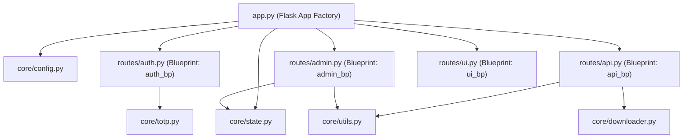
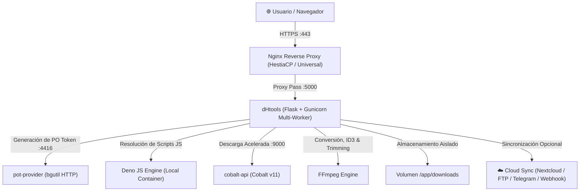
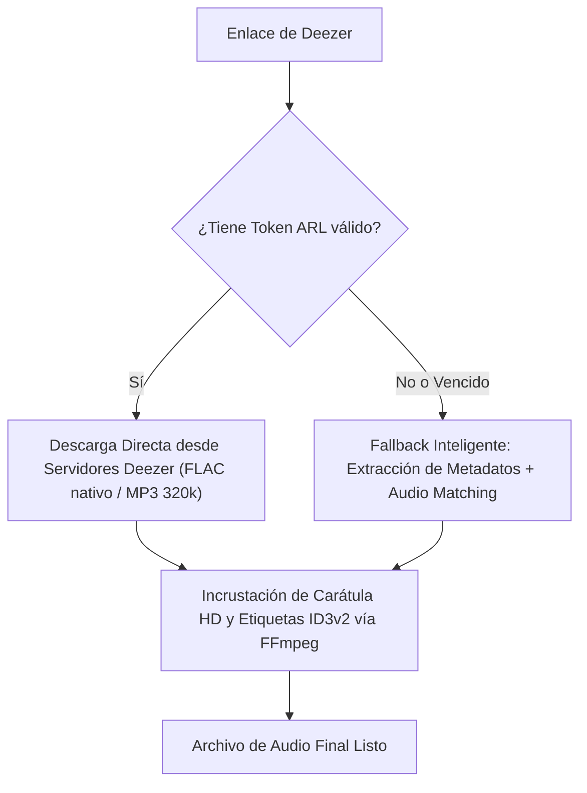

# 📚 Wiki Técnica & Arquitectura del Sistema: dHtools

Documentación técnica detallada sobre el funcionamiento interno, componentes, microservicios, módulos y flujos de trabajo de la plataforma multimedia **dHtools** (Versión `v1.2.0`).

---

## 📑 Tabla de Contenidos
1. [Introducción & Visión General](#1-introducción--visión-general)
2. [Arquitectura Modular del Backend (Flask Blueprints)](#2-arquitectura-modular-del-backend-flask-blueprints)
   - [Estructura del Proyecto](#21-estructura-del-proyecto)
   - [Capa Núcleo (Core Modules)](#22-capa-núcleo-core-modules)
   - [Capa de Rutas (Blueprints)](#23-capa-de-rutas-blueprints)
3. [Arquitectura de Microservicios & Contenedores](#3-arquitectura-de-microservicios--contenedores)
4. [Mecanismos de Descarga por Plataforma](#4-mecanismos-de-descarga-por-plataforma)
   - [YouTube & YouTube Shorts](#41-youtube--youtube-shorts)
   - [Recorte Temporal Inteligente (Trimming)](#42-recorte-temporal-inteligente-trimming)
   - [Deezer (Con ARL vs. Sin ARL)](#43-deezer-con-arl-vs-sin-arl)
   - [Spotify (Extracción de Metadatos + Audio Matching)](#44-spotify-extracción-de-metadatos--audio-matching)
   - [Redes Sociales (TikTok, Instagram, Facebook, Twitch, Kick, X)](#45-redes-sociales)
   - [Gestión y Ciclo de Vida de Cookies de YouTube](#46-gestión-y-ciclo-de-vida-de-cookies-de-youtube)
5. [Motor de Cola por Lotes (Batch Queue)](#5-motor-de-cola-por-lotes-batch-queue)
6. [Módulo de Sincronización en la Nube & Presets Privados](#6-módulo-de-sincronización-en-la-nube--presets-privados)
7. [Asistente Interactivo de Telegram (Telegram Bot Hub)](#7-asistente-interactivo-de-telegram-telegram-bot-hub)
   - [Arquitectura Long-Polling](#71-arquitectura-long-polling)
   - [¿Cada VPS necesita su propio Bot? (Error 409 Conflict)](#72-por-qué-cada-servidor-debe-crear-su-propio-bot)
   - [Guía Rápida: Crear tu Bot con @BotFather](#73-guía-rápida-crear-tu-propio-bot-en-30-segundos)
   - [Vinculación Segura de Cuentas (Telegram Connect)](#74-vinculación-segura-de-cuentas-telegram-connect)
   - [Solicitud Interactiva de Descargas](#75-solicitud-interactiva-de-descargas)
   - [Comandos Disponibles & Reglas de Entrega](#76-comandos-disponibles--reglas-de-entrega)
8. [Gestión de Almacenamiento, Cuotas de Usuario & Auto-Purga](#8-gestión-de-almacenamiento-cuotas-de-usuario--auto-purga)
9. [Seguridad, 2FA (TOTP), Sesiones & Auditoría](#9-seguridad-2fa-totp-sesiones--auditoría)
   - [Autenticación de Dos Factores (RFC 6238)](#91-autenticación-de-dos-factores-rfc-6238)
   - [Servidor SMTP & Recuperación de Contraseña](#92-servidor-smtp--recuperación-de-contraseña)
   - [Telemetría y Revocación Remota de Sesiones](#93-telemetría-y-revocación-remota-de-sesiones)
10. [Preguntas Frecuentes & Diagnóstico (FAQ)](#10-preguntas-frecuentes--diagnóstico-faq)


---

## 1. Introducción & Visión General

**dHtools** es una plataforma web autohospedada de alto rendimiento diseñada para la descarga, conversión, etiquetado, recorte y distribución de contenido multimedia proveniente de más de 1.800 plataformas de internet.

### Objetivos Clave:
- **Resistencia a Bloqueos:** Desacopla la lógica de extracción de los desafíos antibot mediante servidores de Proof-of-Origin (PO Tokens) y motores JavaScript dedicados (`Deno`).
- **Calidad y Fidelidad de Medios:** Descarga hasta 4K/60fps en video y formatos de audio sin pérdida (`FLAC`) o alta tasa de bits (`MP3 320 kbps`) con carátulas y metadatos ID3v2 incrustados.
- **Arquitectura Limpia & Modular:** Desacoplamiento total en Blueprints independientes y módulos reutilizables para facilitar la escalabilidad.
- **Autonomía Operativa:** Panel de control web (`/admin`) para actualizar motores, administrar usuarios, cuotas de disco, monitorear el VPS y gestionar cookies sin terminal SSH.

---

## 2. Arquitectura Modular del Backend (Flask Blueprints)

A partir de la versión `v1.2.0`, **dHtools** abandonó el archivo monolítico `app.py` en favor de una arquitectura desacoplada y mantenible dividida en dos capas principales: **Capa Núcleo (`core/`)** y **Capa de Rutas (`routes/`)**.



### 2.1. Estructura del Proyecto

```text
ytsite/
├── core/                   # Capa Núcleo: lógica de negocio, estado y utilidades
│   ├── config.py           # Variables de entorno, constantes y resolución de paths
│   ├── state.py            # Estado en memoria, locks concurrentes y telemetría
│   ├── utils.py            # Sanitización, cuotas, presets cloud y servidor SMTP
│   ├── totp.py             # Criptografía RFC 6238 para 2FA y backup codes
│   ├── telegram_bot.py     # Asistente interactivo bidireccional y long-polling
│   └── downloader.py       # Cascada de extracción, workers y multiplexación
├── routes/                 # Capa de Controladores (Flask Blueprints)
│   ├── auth.py             # Login, logout, 2FA, reseteo de clave y Telegram connect
│   ├── admin.py            # Panel de control, sesiones activas, cuotas, bot y Git
│   ├── api.py              # API REST de descargas, presets de nube y estados
│   └── ui.py               # Renderizado de vistas HTML, feeds y PWA
├── templates/              # Vistas HTML responsivas con diseño de alta fidelidad
├── static/                 # Estilos CSS, assets y manifiesto PWA
├── proxy-configs/          # Plantillas de Proxy Inverso (Nginx, Hestia, cPanel, Caddy)
├── app.py                  # Inicialización y registro de Blueprints
└── docker-compose.yml      # Orquestación de microservicios
```

### 2.2. Capa Núcleo (Core Modules)

- **`core/config.py`**:
  Centraliza la lectura de variables de entorno, configuración de tiempos de purga (`CLEANUP_AFTER_HOURS`), URLs de microservicios (`POT_PROVIDER_URL`, `COBALT_URL`), resolución dinámica de rutas (`/app` en Docker vs. ruta local en desarrollo) y generación persistente de la clave criptográfica de sesión (`.flask_secret`).
- **`core/state.py`**:
  Gestiona las estructuras de datos en memoria compartida protegidas por bloqueos reentrantes de subprocesos:
  - `JOBS` y `JOBS_LOCK`: Registro en vivo del estado, progreso porcentual y logs de cada trabajo.
  - `QUEUE_LIST` y `QUEUE_LOCK`: Cola secuencial de trabajos en espera.
  - `BATCH_JOBS` y `BATCH_LOCK`: Agrupador de descargas masivas por lotes.
  - `ACTIVE_SESSIONS` y `SESSIONS_LOCK`: Telemetría en tiempo real de sesiones de usuario conectadas.
  - `TELEGRAM_LINK_TOKENS`: Tokens temporales de emparejamiento de un solo uso para Telegram.
- **`core/totp.py`**:
  Motor criptográfico puro en Python que implementa **Time-Based One-Time Password (TOTP)** bajo el estándar **RFC 6238** (HMAC-SHA1, ventana de 30 segundos, 6 dígitos numéricos) y generación de 8 códigos alfanuméricos de recuperación de respaldo de un solo uso.
- **`core/telegram_bot.py`**:
  Motor autónomo de asistente remoto para Telegram vía **Long-Polling**. Procesa comandos (`/start`, `/vincular`, `/descargas`, `/cola`, `/cuota`), inspección asíncrona de enlaces, menús táctiles interactivos (*Inline Keyboards*), telemetría de progreso en tiempo real y entrega directa de archivos multimedia (<= 50 MB) o enlaces web seguros (> 50 MB).
- **`core/utils.py`**:
  Colección de funciones de seguridad y utilidades del sistema:
  - Hashing de contraseñas con `pbkdf2:sha256:600000` con sal aleatoria única.
  - Sanitización canónica de rutas (`safe_download_path`) para prevenir *Path Traversal*.
  - Cálculo de cuotas de almacenamiento en disco por usuario (`get_user_storage_used`, `check_user_storage_quota`).
  - Gestión de perfiles de almacenamiento privados por usuario (`get_user_cloud_presets`, `save_user_cloud_preset`, `delete_user_cloud_preset`).
  - Herramienta universal de validación de conexiones cloud (`test_cloud_connection`).
  - Envío de correos electrónicos vía SMTP autenticado (`send_system_email`) con soporte para STARTTLS y SSL.
- **`core/downloader.py`**:
  Motor integral de extracción y multiplexación. Implementa la cascada inteligente (yt-dlp + Cobalt + Deezer), la inyección de PO Tokens y Deno, la ejecución de recortes temporales estrictos (`download_ranges`), los hilos en segundo plano (`background_queue_worker`, `cleanup_loop`, `auto_update_loop`) y el hook de notificación de progreso hacia Telegram.

### 2.3. Capa de Rutas (Blueprints)

- **`routes/auth.py` (`auth_bp`)**:
  Controla el ciclo de vida de las sesiones de usuario, protección perimetral con decorador `@login_required`, limitador de intentos fallidos por IP (*tarpit* antibuerza bruta), endpoints de configuración 2FA (`/api/auth/2fa/*`) y flujo de restablecimiento de contraseña vía tokens temporales (`/api/auth/forgot-password` y `/api/auth/reset-password`).
- **`routes/admin.py` (`admin_bp`)**:
  Restringido exclusivamente a usuarios con rol `admin`. Proporciona endpoints para métricas en vivo de CPU/RAM/Disco, monitor de microservicios con latencia en ms, gestión de usuarios (creación, edición de cuotas, cambio de contraseñas), auditoría de sesiones activas con revocación remota instantánea, prueba de servidor SMTP y conmutador de ramas Git (`main` vs `dev`).
- **`routes/api.py` (`api_bp`)**:
  API RESTful para interactuar con el motor descargador: pre-inspección de metadatos (`/api/info`), encolado de descargas individuales (`/api/download`), por lotes (`/api/batch-download`) y playlists (`/api/playlist-download`), monitor de progreso en tiempo real (`/api/status/<job_id>`), reordenamiento de prioridades en cola (⬆️/⬇️), cancelación dinámica y consulta de cuota personal (`/api/user/quota`).
- **`routes/ui.py` (`ui_bp`)**:
  Renderiza las interfaces de usuario (`/`, `/admin`, `/login`, `/wiki`), sirve los archivos descargados verificando estrictamente la pertenencia del usuario (`/api/files/<job_id>`) y proporciona el soporte para Progressive Web Apps (`/manifest.json`, `/sw.js`, `/favicon.ico`).

---

## 3. Arquitectura de Microservicios & Contenedores

El sistema opera mediante contenedores Docker orquestados con `docker-compose`:



### Componentes:
1. **`dHtools` (`yt-downloader` en `:5000`):**
   - Núcleo de la aplicación en Python (Flask Blueprints + Gunicorn multihilo).
   - Administra colas de descargas, API REST, renderizado de plantillas y autenticación.
2. **`pot-provider` (`potprovider` en `:4416`):**
   - Microservicio ligero basado en `bgutil-ytdlp-pot-provider`.
   - Genera tokens criptográficos Proof-of-Origin (`visitor_data` y `po_token`) para evitar bloqueos de YouTube.
3. **`cobalt-api` (`cobalt` en `:9000`):**
   - Motor secundario basado en la API de Cobalt v11 para descargas ultrarrápidas de videos y audios individuales.
4. **`Deno` (Integrado en imagen Docker):**
   - Runtime de JavaScript moderno que ejecuta de forma segura los desafíos de código que YouTube inyecta en los reproductores web.
5. **`FFmpeg`:**
   - Utilizado para multiplexar pistas de video y audio independientes, extraer audio a MP3/FLAC/WAV/Opus, incrustar carátulas de álbumes ID3v2, integrar subtítulos y recortar segmentos precisos.

---

## 4. Mecanismos de Descarga por Plataforma

### 4.1. YouTube & YouTube Shorts
YouTube divide las transmisiones de alta calidad en pistas de video y audio separadas (DASH/HLS) y aplica desafíos antibot.
- **Flujo:**
  1. El cliente envía la URL (se normalizan automáticamente los enlaces de Shorts `/shorts/id` a `/watch?v=id`).
  2. `yt-dlp` solicita un PO Token a `http://potprovider:4416/get_pot`.
  3. `Deno` ejecuta el algoritmo de descifrado de firmas de YouTube.
  4. Se descargan los flujos de mejor calidad de video y audio en paralelo.
  5. `FFmpeg` une ambos flujos en un único contenedor (`MP4`, `MKV` o `WebM`) e incrusta los subtítulos si fueron solicitados.

---

### 4.2. Recorte Temporal Inteligente (Trimming)

Permite descargar exclusivamente un fragmento de video o audio especificando tiempos de inicio y fin (`start_time` y `end_time` en formato `HH:MM:SS`, `MM:SS` o segundos).

- **Optimización de Transferencia:**
  - El backend inyecta la directiva `download_ranges` de `yt-dlp` (`download_range_func(None, [(start, end)])`) junto con `force_keyframes_at_cuts = True`.
  - El servidor se conecta al flujo y **únicamente transfiere los bytes correspondientes al intervalo temporal solicitado**.
  - No descarga el video completo de varias horas a disco, reduciendo drásticamente el consumo de red, memoria y tiempo de procesamiento (un recorte de 2 minutos de un video de 10 horas se procesa en ~14 segundos ocupando menos de 10 MB).

---

### 4.3. Deezer (Con ARL vs. Sin ARL)
Deezer almacena pistas en audio de alta definición (FLAC a 1411 kbps y MP3 a 320 kbps).



---

### 4.4. Spotify (Extracción de Metadatos + Audio Matching)
Spotify cifra sus transmisiones de audio con DRM Ogg Vorbis.
- **Solución implementada:**
  1. El sistema consulta la API pública de metadatos de Spotify para obtener: título exacto, lista de artistas, nombre del álbum, número de pista, fecha de lanzamiento y enlace de carátula en alta resolución.
  2. Con esos metadatos, ejecuta una búsqueda ponderada en YouTube Music / YouTube para localizar la pista de audio con mayor tasa de bits.
  3. Descarga el audio, lo convierte a la calidad solicitada (ej. MP3 320 kbps) e incrusta los metadatos oficiales y carátula de Spotify mediante FFmpeg.

---

### 4.5. Redes Sociales (TikTok, Instagram, Facebook, Twitch, Kick, X)
- **TikTok:** Descarga limpia sin marca de agua (*watermark*) vía Cobalt v11 o yt-dlp.
- **Instagram / Facebook / X:** Extracción de Reels, publicaciones individuales y galerías.
- **Twitch / Kick:** Descarga de transmisiones completas (*VODs*) o clips con soporte de recorte por tiempo.

---

### 4.6. Gestión y Ciclo de Vida de Cookies de YouTube
Para acceder a videos restringidos por edad (+18) o contenido exclusivo para miembros:
1. Desde el panel `/admin` -> pestaña **"⚙️ Configuración & Cookies"**, el administrador sube un archivo `cookies.txt` en formato estándar Netscape.
2. El servidor valida obligatoriamente las cookies contra YouTube antes de guardarlas.
3. El contenido del archivo nunca se expone en la interfaz web ni en respuestas de API para preservar la privacidad de la cuenta.

---

## 5. Motor de Cola por Lotes (Batch Queue)

Permite procesar múltiples URLs de forma concurrente con monitoreo individual:
1. **Conmutador Unificado:** Tanto en el Modo Fácil como en el Modo Avanzado, el usuario puede alternar entre `🔗 Enlace Único` y `📋 Descarga en Lote`.
2. **Despacho Concurrente (`ThreadPoolExecutor`):** El backend crea un identificador único de lote (`batch_id`) y lanza hilos de trabajo independientes para cada enlace.
3. **Monitoreo en Tiempo Real (`GET /api/batch-status/<batch_id>`):** La interfaz consulta periódicamente el avance de cada tarea individual.
4. **Empaquetado Automático en ZIP (`GET /api/batch-download-zip/<batch_id>`):** Una vez finalizado el lote, un botón permite descargar todos los archivos comprimidos en un solo `.zip`.

---

## 6. Módulo de Sincronización en la Nube & Presets Privados

Permite reenviar automáticamente los archivos terminados a plataformas de almacenamiento externas sin saturar el disco del servidor ni consumir ancho de banda local:

### 6.1. Hub de Presets de Nube Privados por Usuario
- **Almacenamiento Aislado:** Cada usuario puede registrar sus propios perfiles de almacenamiento (ej. *"Mi Nextcloud Personal"*, *"FTP de Trabajo"*) guardados bajo su cuenta en `users.json`. Ningún otro usuario del sistema puede ver, modificar ni reutilizar dichas credenciales.
- **Selector en 1 Clic:** En el Modo Avanzado de descargas, el usuario puede seleccionar su preset deseado desde un menú desplegable para que el archivo terminado se transmita inmediatamente al finalizar la descarga.
- **Protocolos Soportados:**
  - **Nextcloud / ownCloud / WebDAV:** Envía el archivo por HTTP `PUT` directamente a la carpeta remota configurada con soporte para autenticación básica y App Passwords.
  - **Servidor FTP:** Se conecta mediante `ftplib` al host y puerto configurados y transfiere el archivo por comando `STOR`.
  - **Webhook HTTP:** Emite una solicitud `POST` JSON con los metadatos del archivo para integración con plataformas de automatización (n8n, Zapier, Make).

### 6.2. Herramienta de Validación en 1 Clic
Tanto en la interfaz de descargas como en el panel administrativo, los usuarios y administradores disponen de botones `🧪 Probar WebDAV` y `🧪 Probar FTP` que efectúan un handshake de red en vivo contra el servidor remoto antes de guardar el perfil.

---

## 7. Asistente Interactivo de Telegram (Telegram Bot Hub)

El **Telegram Bot Hub** transforma dHtools en un asistente multimedia personal accesible directamente desde Telegram, permitiendo solicitar descargas, consultar el historial, monitorear la cola y gestionar el almacenamiento sin abrir el navegador.

### 7.1. Arquitectura Long-Polling
A diferencia de los bots tradicionales que exigen exponer puertos públicos hacia internet, configurar dominios dedicados y emitir certificados SSL para webhooks, el bot de dHtools funciona mediante **Long-Polling asíncrono**:
- Un worker continuo en Python consulta periódicamente el endpoint `/getUpdates` de Telegram con un timeout de 20 segundos.
- Si no hay token configurado o el bot está deshabilitado en `/admin`, el hilo entra en reposo absoluto sin consumir ciclos de CPU ni memoria.

### 7.2. ¿Por qué cada servidor debe crear su propio Bot?
> [!IMPORTANT]
> **Si desplegás dHtools en tu propio servidor VPS, debés crear tu propio bot en Telegram.**  
> Hay dos motivos técnicos y de seguridad fundamentales:
> 1. **Limitación de Telegram (Error 409 Conflict):** La API de Telegram no admite que dos servidores consulten `getUpdates` con el mismo token simultáneamente. Si dos servidores usan el mismo bot, Telegram responde con `409 Conflict: terminated by other getUpdates request; make sure that only one bot instance is running`, provocando desconexiones y pérdida de mensajes.
> 2. **Privacidad y Aislamiento de Archivos:** Cada bot interactúa exclusivamente con el disco y la base de datos de su servidor local. Con tu propio bot, tus descargas y enlaces son 100% privados y no se mezclan con ningún otro servidor del mundo.

### 7.3. Guía Rápida: Crear tu propio Bot en 30 Segundos
1. Abrí tu aplicación de Telegram y buscá al bot oficial **`@BotFather`**.
2. Enviá el comando `/newbot`.
3. Ingresá el nombre que querés que tenga tu bot (ej. *Mi dHtools Bot*).
4. Ingresá un nombre de usuario terminado en `bot` (ej. *midhtools_descargas_bot*).
5. `@BotFather` te responderá entregándote tu **HTTP API Token** (ej. `7123456789:AAHk...`).
6. Ingresá a tu panel de dHtools en `/admin` -> pestaña **Cloud Sync / Telegram Bot**, pegá tu token en el campo **Bot Token** y tildá **Habilitar Bot**.
7. Hacé clic en **Guardar Configuración**. El badge cambiará inmediatamente a `● En Línea (@tu_bot)`.

### 7.4. Vinculación Segura de Cuentas (Telegram Connect)
Para respetar las cuotas de almacenamiento y el aislamiento multiusuario:
1. El usuario inicia sesión en la web de dHtools y hace clic en el botón **✈️ Telegram** de la barra lateral.
2. La plataforma genera un **Token Temporal de Emparejamiento** de 6 dígitos (ej. `DHT-715198`) con expiración estricta de 10 minutos.
3. El usuario puede hacer clic en **"✈️ Abrir Bot en Telegram"** (que envía automáticamente `/start link_DHT-XXXXXX`) o enviar manualmente `/vincular DHT-XXXXXX` al chat del bot.
4. El bot asocia el `chat_id` de Telegram con el usuario en `users.json`. A partir de ese momento, todas las solicitudes que reciba respetarán el rol (`admin` o `downloader`) y la cuota de almacenamiento del usuario.

### 7.5. Solicitud Interactiva de Descargas
- El usuario puede compartir cualquier enlace compatible (YouTube, Spotify, Deezer, TikTok, Instagram, Twitter, etc.) al chat del bot.
- El bot inspecciona el enlace y responde con un mensaje enriquecido acompañado de botones táctiles (*Inline Keyboards*):
  - **Video:** `[ 🎬 1080p ]` `[ 🎬 720p ]` `[ 🎬 480p ]`
  - **Audio:** `[ 🎵 MP3 320k ]` `[ 🎵 MP3 192k ]` `[ 🎵 FLAC ]`
- Al pulsar un botón, la tarea se añade a la cola de dHtools.
- Durante la descarga, el hook de progreso edita periódicamente el mensaje en el chat con una barra de avance dinámica:  
  `⚡ Descargando: Bohemian Rhapsody`  
  `[████████░░░░] 65% | 5.2 MB/s | ETA: 12s`

### 7.6. Comandos Disponibles & Reglas de Entrega
| Comando | Función |
| :--- | :--- |
| `/start` | Mensaje de bienvenida, estado de vinculación o auto-emparejamiento con deep-link. |
| `/vincular <token>` | Canjea un token temporal generado en la web para asociar la cuenta. |
| `/desvincular` | Desconecta la cuenta de Telegram de la plataforma web. |
| `/descargas` | Lista las últimas 5 descargas del usuario con botón para recibir el archivo en el chat. |
| `/cola` | Muestra trabajos activos y pendientes con botón interactivo para cancelar. |
| `/cuota` | Informa el almacenamiento en disco consumido vs. cuota asignada. |
| `/ayuda` | Despliega el resumen de comandos y capacidades del bot. |

**Reglas de Entrega:**
- **Archivos de hasta 50 MB:** El bot sube el archivo directamente al chat de Telegram utilizando el método correspondiente (`sendAudio`, `sendVideo` o `sendDocument`).
- **Archivos mayores a 50 MB:** Telegram impone un límite de 50 MB para subida de bots por la API estándar. En estos casos, el bot notifica que la descarga concluyó exitosamente y adjunta un botón seguro con enlace web directo para descargarlo desde el navegador.

---

## 8. Gestión de Almacenamiento, Cuotas de Usuario & Auto-Purga

Para proteger el disco duro del VPS y controlar el uso por parte de los usuarios:
1. **Control de Cuotas por Usuario (`quota_gb`):**
   - El administrador puede asignar límites de almacenamiento individual (ej. 5 GB, 10 GB o ilimitada).
   - El sistema calcula el tamaño de las descargas activas en tiempo real (`get_user_storage_used`) y bloquea preventivamente nuevas descargas si se excede la cuota.
   - El usuario visualiza su barra de progreso de almacenamiento directamente en el panel lateral.
2. **Retención Programada (`CLEANUP_AFTER_HOURS`):**
   - Un hilo en segundo plano elimina automáticamente los archivos que superen las horas de antigüedad configuradas (por defecto 24h).
3. **Purga de Emergencia Automática:**
   - Si el espacio ocupado en el disco del VPS supera el 85% o si quedan menos de 2 GB libres, el sistema purga automáticamente las descargas más antiguas hasta restablecer un margen seguro.

---

## 9. Seguridad, 2FA (TOTP), Sesiones & Auditoría

### 9.1. Autenticación de Dos Factores (RFC 6238)
- **Opcional por Usuario:** Cada usuario puede activar o desactivar la autenticación en dos pasos desde su modal de seguridad.
- **Compatibilidad Universal:** Funciona con Google Authenticator, Microsoft Authenticator, Authy, Bitwarden, Aegis, etc.
- **Asistente Visual:** Muestra un código QR dinámico generado en el cliente y la clave Base32 secreta.
- **Códigos de Respaldo:** Genera 8 códigos de emergencia de un solo uso para recuperar el acceso si se pierde el dispositivo autenticador.

### 9.2. Servidor SMTP & Recuperación de Contraseña
- **Configuración en Panel Admin:** Soporta servidores SMTP estándar (Gmail, Outlook, servidores privados) con cifrado STARTTLS o SSL/TLS.
- **Recuperación en 1 Clic:** Desde la pantalla de login, los usuarios pueden solicitar un enlace de restablecimiento.
- **Tokens Criptográficos Seguros:** Genera tokens temporales con expiración estricta de 1 hora.

### 9.3. Telemetría y Revocación Remota de Sesiones
- **Monitor en Vivo:** El panel de administración muestra todas las sesiones activas en el servidor con su IP de origen, navegador, dispositivo y última hora de actividad.
- **Revocación Remota:** Los administradores pueden cerrar remotamente cualquier sesión activa sospechosa con un solo clic.

---

## 10. Preguntas Frecuentes & Diagnóstico (FAQ)

### ¿Si instalo dHtools en otro VPS tengo que usar el mismo Bot de Telegram o crear uno nuevo?
**Debés crear tu propio bot en `@BotFather`.** La API de Telegram no permite que dos servidores hagan Long-Polling simultáneo con el mismo token (arroja error `409 Conflict`). Además, tener tu propio bot garantiza que tus descargas y credenciales sean 100% privadas y residan exclusivamente en tu propio servidor.

### ¿Qué hacer si YouTube empieza a fallar con error "Sign in to confirm you're not a bot"?
1. Ingresá al panel `/admin` -> pestaña **"🚀 Actualizador de Motores"** y hacé clic en **"⟳ Actualizar yt-dlp Ahora"**.
2. Verificá en la pestaña **"📊 Microservicios"** que `pot-provider` y `Deno` estén en estado 🟢 Online.
3. Si el bloqueo persiste, exportá un archivo `cookies.txt` de tu navegador e ingresalo en la pestaña **"⚙️ Configuración & Cookies"**.

### ¿Por qué una descarga en 720p/1080p puede descargarse en 360p?
Si la cuenta de Google utilizada en `cookies.txt` está enrolada en el experimento **SABR** de YouTube, YouTube oculta las URLs directas de alta definición para esa sesión web. Subir un archivo `cookies.txt` de una cuenta no afectada o configurar un Proxy Residencial en `/admin` resuelve la restricción de inmediato.

### ¿Se pueden descargar playlists de 100 canciones a la vez?
Sí. El sistema procesa cada elemento en cola y los entrega empaquetados en un archivo comprimido `.zip` con todos los nombres de archivo sanitizados y metadatos incrustados.

