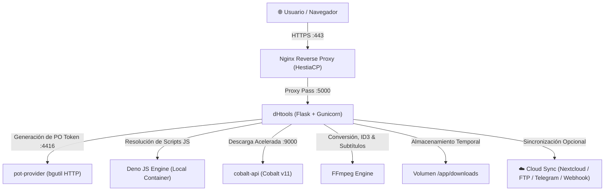
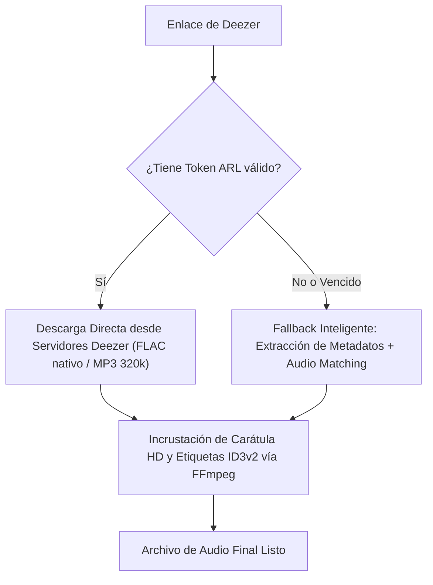

# 📚 Wiki Técnica & Arquitectura del Sistema: dHtools

Documentación técnica detallada sobre el funcionamiento interno, componentes, microservicios y flujos de trabajo de la plataforma multimedia **dHtools**.

---

## 📑 Tabla de Contenidos
1. [Introducción & Visión General](#1-introducción--visión-general)
2. [Arquitectura de Microservicios](#2-arquitectura-de-microservicios)
3. [Mecanismos de Descarga por Plataforma](#3-mecanismos-de-descarga-por-plataforma)
   - [YouTube & YouTube Shorts](#31-youtube--youtube-shorts)
   - [Deezer (Con ARL vs. Sin ARL)](#32-deezer-con-arl-vs-sin-arl)
   - [Spotify (Extracción de Metadatos + Audio Matching)](#33-spotify-extracción-de-metadatos--audio-matching)
   - [Redes Sociales (TikTok, Instagram, Facebook, Twitch, Kick, X)](#34-redes-sociales)
4. [Motor de Cola por Lotes (Batch Queue)](#4-motor-de-cola-por-lotes-batch-queue)
5. [Módulo de Sincronización en la Nube (Cloud Sync)](#5-módulo-de-sincronización-en-la-nube-cloud-sync)
6. [Gestión de Almacenamiento & Auto-Purga](#6-gestión-de-almacenamiento--auto-purga)
7. [Seguridad, Autenticación & Control de Acceso (RBAC)](#7-seguridad-autenticación--control-de-acceso-rbac)
8. [Preguntas Frecuentes & Diagnóstico (FAQ)](#8-preguntas-frecuentes--diagnóstico-faq)

---

## 1. Introducción & Visión General

**dHtools** es una plataforma web autohospedada diseñada para la descarga, conversión, etiquetado y distribución de contenido multimedia proveniente de más de 1.800 plataformas de internet.

### Objetivos Clave:
- **Resistencia a Bloqueos:** Desacopla la lógica de extracción de los desafíos antibot mediante servidores de Proof-of-Origin (PO Tokens) y motores JavaScript dedicados.
- **Calidad y Fidelidad de Medios:** Descarga hasta 4K/60fps en video y formatos de audio sin pérdida (FLAC) o alta tasa de bits (MP3 320 kbps) con carátulas y metadatos ID3v2 incrustados.
- **Autonomía Operativa:** Panel de control web (`/admin`) para actualizar motores, administrar usuarios, monitorear el VPS y gestionar cookies sin terminal SSH.

---

## 2. Arquitectura de Microservicios

El sistema opera mediante contenedores Docker orquestados con `docker-compose`:

### Componentes:
1. **`dHtools` (`yt-downloader` en `:5000`):**
   - Núcleo de la aplicación en Python (Flask + Gunicorn multihilo).
   - Administra colas de descargas, API REST, renderizado de plantillas y autenticación.
2. **`pot-provider` (`potprovider` en `:4416`):**

   - Microservicio ligero basado en `bgutil-ytdlp-pot-provider`.
   - Genera tokens criptográficos Proof-of-Origin (`visitor_data` y `po_token`) para evitar bloqueos de YouTube.
3. **`cobalt-api` (`cobalt` en `:9000`):**
   - Motor secundario basado en la API de Cobalt v11 para descargas ultrarrápidas de videos y audios individuales.
4. **`Deno` (Integrado en imagen Docker):**
   - Runtime de JavaScript moderno que ejecuta de forma segura los desafíos de código que YouTube inyecta en los reproductores web.
5. **`FFmpeg`:**
   - Utilizado para multiplexar pistas de video y audio independientes, extraer audio a MP3/FLAC/WAV/Opus, incrustar carátulas de álbumes ID3v2 e integrar subtítulos.

---

## 3. Mecanismos de Descarga por Plataforma

### 3.1. YouTube & YouTube Shorts
YouTube divide las transmisiones de alta calidad en pistas de video y audio separadas (DASH/HLS) y aplica desafíos antibot.
- **Flujo:**
  1. El cliente envía la URL (se normalizan automáticamente los enlaces de Shorts `/shorts/id` a `/watch?v=id`).
  2. `yt-dlp` solicita un PO Token a `http://potprovider:4416/get_pot`.
  3. `Deno` ejecuta el algoritmo de descifrado de firmas de YouTube.
  4. Se descargan los flujos de mejor calidad de video y audio en paralelo.
  5. `FFmpeg` une ambos flujos en un único contenedor (`MP4`, `MKV` o `WebM`) e incrusta los subtítulos si fueron solicitados.

---

### 3.2. Deezer (Con ARL vs. Sin ARL)
Deezer almacena pistas en audio de alta definición (FLAC a 1411 kbps y MP3 a 320 kbps).

- **Con Token ARL:** 
  - El token ARL autentica la sesión de Deezer.
  - El servidor calcula la clave de descifrado simétrico (*Blowfish*) a partir del ID de la canción y descarga el archivo original directamente desde el CDN de Deezer en **FLAC nativo (sin pérdida)** o MP3 a 320 kbps.
- **Sin ARL (o si el token expiró):**
  - El backend extrae los metadatos oficiales de Deezer (Artista, Título, Álbum, Carátula en alta definición vía API pública).
  - Activa el mecanismo de **Audio Matching** para localizar la versión de estudio idéntica en streaming abierto.
  - FFmpeg procesa el audio e inyecta la carátula y los tags ID3v2, entregando un archivo perfecto sin que la descarga falle.

---

### 3.3. Spotify (Extracción de Metadatos + Audio Matching)
**¿Por qué no se descarga directamente del CDN de Spotify?**
Spotify protege el 100% de sus archivos de audio con **DRM Widevine (cifrado AES-128)**. Para desencriptar directamente desde sus servidores se requeriría una cuenta de pago y claves privadas de hardware CDM; Spotify detecta estas descargas automatizadas y bloquea las cuentas.

**Solución Implementada:**
1. **Extracción Oficial:** El sistema consulta el endpoint oEmbed / API de Spotify y obtiene los metadatos exactos (título, artista principal, colaboradores, nombre del álbum y carátula en alta resolución).
2. **Audio Matching:** Busca la pista de estudio oficial de mayor fidelidad acústica disponible.
3. **Post-procesamiento ID3 con FFmpeg:** Se procesa el archivo al bitrate seleccionado (hasta 320 kbps o FLAC) y se incrusta la portada del álbum y etiquetas ID3v2 completas.
4. **Resultado:** Para el usuario que escucha en su teléfono, auto o PC, el archivo es idéntico al tema de Spotify con su información y arte de tapa completos.

---

### 3.4. Redes Sociales
- **TikTok:** Descarga de videos en alta definición sin marca de agua (*watermark*).
- **Instagram:** Descarga de Reels, videos del feed y publicaciones públicas.
- **Twitch & Kick:** Extracción de clips y transmisiones pasadas (VODs).
- **Facebook & X (Twitter):** Extracción de videos nativos en máxima resolución disponible.

---

## 4. Motor de Cola por Lotes (Batch Queue)

La versión 2.0 introduce el procesamiento concurrente de listas de enlaces:

1. **Ingreso Múltiple:** El usuario pega varias URLs (una por línea) en el modo `📋 Cola de Enlaces Múltiples`.
2. **Despacho Concurrente (`ThreadPoolExecutor`):** El backend crea un identificador único de lote (`batch_id`) y lanza hilos de trabajo independientes para cada enlace.
3. **Monitoreo en Tiempo Real (`GET /api/batch-status/<batch_id>`):** La interfaz consulta periódicamente el avance de cada tarea individual.
4. **Empaquetado Automático en ZIP (`GET /api/batch-download-zip/<batch_id>`):** Una vez finalizado el lote, un botón permite descargar todos los archivos comprimidos en un solo `.zip`.

---

## 5. Módulo de Sincronización en la Nube (Cloud Sync)

Permite reenviar automáticamente los archivos terminados a plataformas remotas sin consumir ancho de banda en la PC del usuario:

- **Nextcloud / ownCloud / WebDAV:** Envía el archivo por HTTP `PUT` directamente a la carpeta remota configurada, soportando autenticación por contraseña o App Token.
- **Servidor FTP:** Se conecta mediante `ftplib` al host y puerto configurados y transfiere el archivo por comando `STOR`.
- **Telegram Bot Uploader:** Para archivos de hasta 50 MB, el bot envía el video o audio directamente a un chat privado o canal de Telegram con su título como pie de foto.
- **Webhook HTTP:** Emite una solicitud `POST` JSON con el nombre del archivo, peso en bytes, URL de descarga y metadatos para integración con plataformas de automatización (n8n, Zapier, Make).

---

## 6. Gestión de Almacenamiento & Auto-Purga

Para proteger el disco duro del VPS y evitar saturación:
- **Retención Programada (`CLEANUP_AFTER_HOURS`):** Un hilo en segundo plano elimina automáticamente los archivos que superen las horas de antigüedad configuradas (por defecto 24h).
- **Purga de Emergencia Automática:** Si el espacio ocupado en el disco del VPS supera el umbral configurado (por defecto 85%) o si quedan menos de 2 GB libres, el sistema purga automáticamente las descargas más antiguas hasta restablecer un margen seguro.
- **Purga Manual:** Botón **"🧹 Limpiar"** en la interfaz y en `/admin` para liberar espacio a demanda.

---

## 7. Seguridad, Autenticación & Control de Acceso (RBAC)

1. **Autenticación HTTP Basic:** Protegida por cabecera `Authorization`.
2. **Almacenamiento de Credenciales (`users.json`):** Las contraseñas se almacenan con hash criptográfico unidireccional `SHA-256` con salt único.
3. **Roles de Usuario:**
   - `admin`: Acceso irrestricto al descargador, al panel `/admin`, diagnósticos, actualización de motores, edición de cookies, configuración de nube y gestión de usuarios.
   - `downloader`: Acceso exclusivo a la interfaz de descargas (bloqueado con `403 Forbidden` en cualquier ruta administrativa).
4. **Privacidad Web:** Cabeceras `X-Robots-Tag: noindex, nofollow, noarchive` y `robots.txt` para evitar que motores de búsqueda indexen el contenido o el sitio.

---

## 8. Preguntas Frecuentes & Diagnóstico (FAQ)

### ¿Qué hacer si YouTube empieza a fallar con error "Sign in to confirm you're not a bot"?
1. Ingresá al panel `/admin` -> pestaña **"🚀 Actualizador de Motores"** y hacé clic en **"⟳ Actualizar yt-dlp Ahora"**.
2. Verificá en la pestaña **"📊 Microservicios"** que `pot-provider` y `Deno` estén en estado 🟢 Online.
3. Si el bloqueo persiste, exportá un archivo `cookies.txt` de tu navegador e ingresalo en la pestaña **"⚙️ Configuración & Cookies"**.

### ¿Puedo descargar playlists de 100 canciones a la vez?
Sí. El sistema procesa cada elemento secuencial o concurrentemente y los entrega empaquetados en un archivo comprimido `.zip` con todos los nombres de archivo sanitizados.

### ¿Se pueden descargar videos de Netflix o Disney+?
No. Esos servicios utilizan cifrado DRM Widevine L1 con claves de hardware que ningún descargador de código abierto puede desencriptar.
